<div align="center">
  
</div>

<br />

```text
~ $ cat contributing.txt
──────────────────────────────────────────────────
  thanks for looking.

  liffy is a student project built in the open, and
  outside contributions are genuinely welcome — bug
  reports especially, since we only have two people
  looking at it.

  if anything in here is unclear or wrong, that is
  itself worth an issue.
──────────────────────────────────────────────────
```


### `// before you start`

**Something broken?** Open an issue. A stack trace and the steps that produced it are worth more than a careful description.
<br /><sub>`bug report` · `stack trace` · `steps to reproduce`</sub>

**Something to add?** Open an issue first and say what you have in mind. It saves you building something we were about to change, and it is a faster conversation than a review on a finished branch.
<br /><sub>`issue first` · `before you build it`</sub>

**Found a security problem?** Do not open an issue — see **[SECURITY.md](SECURITY.md)**.
<br /><sub>`private disclosure` · `not a public issue`</sub>


### `// getting it running`

**[docs/SETUP.md](docs/SETUP.md)** is the full walkthrough for macOS and Windows, including prerequisites, environment variables, and the errors people usually hit. The short version:

```bash
git clone https://github.com/lucenity0/Liffy.git
cd Liffy
cp backend/.env.example backend/.env    # then fill it in
cp frontend/.env.example frontend/.env  # nothing to fill in — just the API's URL
```

**You do not need a paid API key to work on Liffy.** Point `LLM_PROVIDER` at a local Ollama and the whole pipeline runs free and offline; embeddings are local by default regardless.
<br /><sub>`ollama` · `free` · `offline` · [choosing a model](README.md#-choosing-a-model) · [every variable](docs/configuration.md)</sub>


### `// the workflow`

PR-based. No direct pushes to `main`.

```text
branch    feat/… · fix/… · chore/… · docs/…
commits   feat: add github webhook endpoint
rules     1 approval min · CI green · small PRs
```

1. Branch off `main` with one of the prefixes above.
2. Make the change. Keep it to one thing — a PR that fixes a bug *and* renames
   a module is two PRs, and the review is worse for both.
3. Run the gate locally (below). CI runs exactly the same commands, so a green
   run locally means a green run on GitHub.
4. Open the PR. Say **what** changed, **why**, and **how to test it**. If it is
   visual, put a screenshot in — both themes if it touches styling.

**Commit messages** — conventional-commit prefixes: `feat:`, `fix:`, `chore:`, `docs:`, `test:`, `refactor:`. Subject in the imperative and under ~72 characters. Explain the *why* in the body when it is not obvious from the diff — that is the part nobody can reconstruct later.
<br /><sub>`feat:` · `fix:` · `chore:` · `docs:` · `test:` · `refactor:`</sub>


### `// the gate`

Both suites must pass before a PR is ready. This is what [`.github/workflows/ci.yml`](.github/workflows/ci.yml) runs.



| suite | run it |
| :--- | :--- |
| **backend** | `cd backend`<br />`pip install -r requirements-dev.txt`<br />`PYTHONPATH=. pytest` |
| **frontend** | `cd frontend`<br />`npm run lint`<br />`npm run typecheck`<br />`npm run test`<br />`npm run build` |

`requirements-dev.txt`, not `requirements.txt`: it pulls the runtime in with `-r requirements.txt` and adds the test tooling on top, which is why no production image ends up carrying a test runner.

`npm run build` is not redundant with the rest: it is what catches Monaco failing to split into its own chunk, which no test and no type can see.


### `// writing the code`

The repo has a strong house style. The fastest way to match it is to read the file you are editing before adding to it, but the recurring rules are:

**Comments explain *why*, not *what*.** The code already says what it does. A comment earns its place by recording the reason a choice was made, the thing that broke before, or the constraint that is not visible locally.
<br /><sub>`the reason` · `what broke before` · `the constraint you cannot see`</sub>

**Follow the surrounding code.** Naming, structure and comment density should match the file you are in rather than your own preferences.
<br /><sub>`read it before you add to it`</sub>

**Tests come with behaviour changes.** Backend tests live in `backend/tests/`, frontend tests sit next to what they test as `*.test.tsx`.
<br /><sub>`backend/tests/` · `*.test.tsx`</sub>

**Frontend styling goes through the design system.** Colours, spacing and type come from the tokens in `frontend/src/index.css`. Tailwind's default palette is deliberately removed, so `bg-blue-500` does not exist — if you need a colour that is not there, that is a discussion, not a one-off value.
<br /><sub>`design tokens` · `no bg-blue-500` · `index.css`</sub>

**Both themes, always.** Paper and graphite are a structural inversion, not a lightness flip. Check your change in both; `/_styleguide` renders the whole system on one page in dev.
<br /><sub>`paper` · `graphite` · `/_styleguide`</sub>

**Accessibility is part of the work.** Labelled controls, real headings, keyboard reachable, and decorative graphics marked `aria-hidden`.
<br /><sub>`labelled` · `keyboard reachable` · `aria-hidden`</sub>

<details>
<summary><b>Architecture notes</b> — worth reading before a substantial change</summary>

<br />

- **[docs/architecture.md](docs/architecture.md)** — how the pieces fit together
- **[docs/decisions/](docs/decisions/)** — why things are the way they are
- **[docs/llm-pipeline.md](docs/llm-pipeline.md)** — how a review is produced
- **[docs/indexing.md](docs/indexing.md)** — what gets indexed and how it is chunked
- **[docs/configuration.md](docs/configuration.md)** — every environment variable, grouped
- **[docs/api.md](docs/api.md)** — the API surface

Providers sit behind protocols (`ReviewLLM`, `EmbeddingProvider`) on purpose. Adding a model provider should mean writing one class and a config branch, not touching `review_service.py` — see [the provider seam](docs/architecture.md#the-provider-seam). If you find yourself editing the service to add a provider, something has gone wrong: say so in the issue.

</details>


### `// reviews`

Expect comments. They are about the code, never about you, and a question in a review is usually a real question rather than a disguised objection. Push follow-up commits rather than force-pushing over the branch while a review is in progress — it keeps the discussion anchored to what the reviewer read.

We aim to respond within a few days. If a PR goes quiet for longer than a week, a nudge is welcome and not rude; it usually means a deadline landed.

<br /><sub>`about the code` · `follow-up commits, not force-pushes` · `a nudge after a week is fine`</sub>


### `// licence`

By contributing you agree that your contributions are licensed under the [MIT License](LICENSE), the same terms as the rest of the project.

<br />

<div align="center"><sub><a href="LICENSE">MIT licensed</a> &nbsp;·&nbsp; <a href="README.md">readme</a> &nbsp;·&nbsp; <a href="SECURITY.md">security policy</a> &nbsp;·&nbsp; <a href="CODE_OF_CONDUCT.md">code of conduct</a></sub></div>

<br />

<div align="center"><sub>if anything here is unclear or wrong, that is itself worth an issue</sub></div>
