<div align="center">
  
</div>

<br />

```text
~ $ cat liffy.txt
──────────────────────────────────────────────────
  your AI senior engineer  ·  open source  ·  self-hosted
  connects to github, reads your pull requests, and
  writes structured, senior-engineer-level feedback.
  your repos, your llm keys, your infrastructure.
──────────────────────────────────────────────────
```


### `// features`

**Reads PRs like a person** — pulls the diff, walks the changed files, and leaves line-anchored comments: what's wrong, why it matters, and how to fix it.
<br /><sub>`diff parsing` · `structured output` · `severity levels`</sub>

**RAG over your codebase** — indexes your repo into a vector store so reviews are grounded in *your* conventions and surrounding code, not generic advice.
<br /><sub>`ChromaDB` · `embeddings` · `LangChain chains`</sub>

**Bring your own keys** — no hosted middleman reading your code. Point it at OpenAI, or Claude via Vertex AI (with prompt caching). Keys never leave your `.env`.
<br /><sub>`BYO LLM` · `Vertex AI` · `prompt caching`</sub>

**GitHub-native** — OAuth sign-in, webhook-triggered reviews on every push, feedback posted right where you already argue about code.
<br /><sub>`OAuth` · `webhooks` · `HMAC-verified`</sub>

**Async by design** — reviews run as background jobs, so a 40-file PR doesn't block anything. Watch it work from the dashboard.
<br /><sub>`Celery` · `Redis` · `job status`</sub>

**One-command setup** — bootstrap scripts for macOS *and* Windows get you from clone to running in minutes.


### `// how it works`

```text
push to PR ──▶ github webhook ──▶ celery queue
                                      │
              chroma (your codebase) ─┼─▶ RAG context
                                      ▼
                            llm review chain
                                      │
                                      ▼
              structured feedback ──▶ posted to the PR
```


### `// stack`

`FastAPI` &nbsp;`Celery` &nbsp;`PostgreSQL` &nbsp;`Redis` &nbsp;·&nbsp; `React` &nbsp;`TypeScript` &nbsp;`Vite` &nbsp;`Tailwind` &nbsp;·&nbsp; `ChromaDB` &nbsp;`LangChain`

```text
liffy/
├── backend/      FastAPI + Celery + PostgreSQL + Redis
├── frontend/     React + TypeScript + Vite + Tailwind
├── chroma/       ChromaDB vector store (gitignored, auto-created)
└── docs/         Setup guide, architecture decisions, API reference
```


### `// quickstart`

```bash
git clone https://github.com/lucenity0/Liffy.git
cd Liffy
cp .env.example backend/.env   # fill in your keys
```

Then three terminals (from the right directories, with the backend venv active):
- `cd backend && uvicorn app.main:app --reload`
- `cd backend && celery -A app.workers.celery_app worker --loglevel=info` (macOS and Windows: add `--pool=solo`)
- `cd frontend && npm run dev`

Full walkthrough (macOS + Windows, prerequisites, env vars, common issues): **[docs/SETUP.md](docs/SETUP.md)**


### `// contributing`

PR-based workflow — no direct pushes to `main`.

```text
branch    feat/… · fix/… · chore/… · docs/…
commits   feat: add github webhook endpoint
rules     1 approval min · CI green · small PRs · say what/why/how-to-test
```


### `// docs`

**[ setup ](docs/SETUP.md)** &nbsp;·&nbsp; **[ api reference ](docs/api.md)** &nbsp;·&nbsp; **[ llm pipeline ](docs/llm-pipeline.md)** &nbsp;·&nbsp; **[ decisions ](docs/decisions/)**

<br />

<div align="center"><sub>built by <a href="https://github.com/lucenity0">@lucenity0</a> · your code never leaves your machine — that's the whole point</sub></div>
